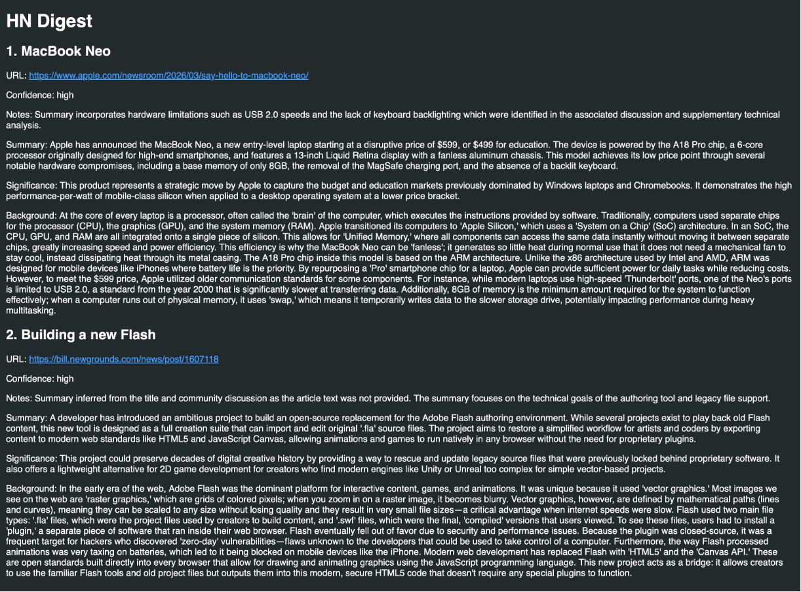

# HN Digest

Generate a daily HTML digest of the latest Hacker News posts using Gemini for summaries and key terms, delivered straight to your inbox.



## What it does

- Scrapes the top Hacker News titles and article text
- Sends the articles to Gemini for summaries and key terms
- Builds an HTML report and emails it to you
- Runs automatically via GitHub Actions (daily at 9 AM UTC)

## Requirements

- Python 3.9+
- A Gemini API key
- A Gmail account with an App Password for sending emails

## Setup

1. Create and activate a virtual environment (optional but recommended).
2. Install dependencies:

```bash
pip install -r requirements.txt
```

3. Create a `.env` file in the project root:

```bash
GEMINI_API_KEY=your_api_key_here
EMAIL_ADD=your_email@gmail.com
GOOGLE_APP_PASS=your_google_app_password
```

To generate a Google App Password, go to your Google Account > Security > 2-Step Verification > App passwords.

## Run locally

```bash
python main.py
```

This will scrape HN, generate summaries, and email the digest to the configured address.

## GitHub Actions (automated daily digest)

The included workflow (`.github/workflows/send_email.yml`) runs the script daily at 9 AM UTC.

To enable it:

1. Fork or push this repo to GitHub.
2. Go to Settings > Secrets and variables > Actions.
3. Add the following repository secrets:
   - `GEMINI_API_KEY`
   - `EMAIL_ADD`
   - `GOOGLE_APP_PASS`

You can also trigger the workflow manually from the Actions tab.

## Configuration

- Edit `main.py` to change the number of articles (`scrape(limit=...)`).
- Update `prompt.py` to adjust the summarization instructions.
- Edit `template.html` to change the report layout.

## Notes

- If an article's body can't be extracted, the summary is inferred from the title.
- Network access is required to scrape HN and call Gemini.

#README generated using Claude CLI
